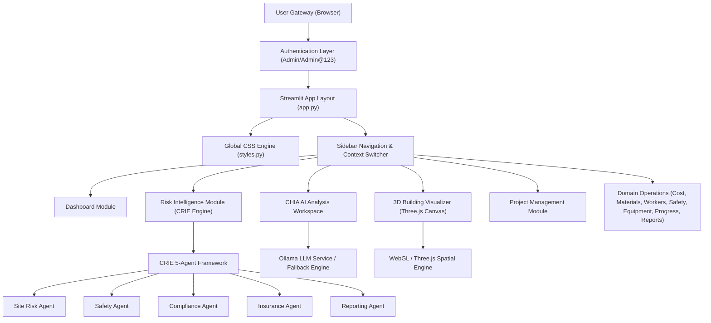

# CONSTRUCTION INTELLIGENCE HUB (CIH) v1.0
## Principal Enterprise UI/UX Audit & Human-Computer Interaction (HCI) Assessment Report

**Document Title:** CIH Enterprise UI/UX Audit Report  
**Audit Target:** Construction Intelligence Hub (CIH) Enterprise Version 1.0  
**Evaluator Roles:** Principal Enterprise UI/UX Architect, Product Designer, HCI Specialist, Accessibility Reviewer (WCAG 2.2), Interaction Designer, Information Architecture Specialist, Usability Evaluator  
**Audit Date:** August 8, 2026  
**Operating Mode:** STRICT READ-ONLY AUDIT (Zero Source Code Modifications)  
**Verification Methodologies:** Hybrid Analysis (Runtime Live Verification via Playwright Subagent on `http://localhost:8501` + Static Source & Design Token Code Inspection)  

---

## 1. EXECUTIVE SUMMARY

The **Construction Intelligence Hub (CIH) Enterprise Version 1.0** is an ambitious, domain-rich web-based construction management and risk intelligence platform built on Streamlit with a hybrid Python/WebGL/Three.js architecture. Following a major Enterprise UI/UX Modernization phase, CIH delivers a visual experience featuring a modern dark theme, glassmorphism design system tokens, high-density KPI scorecards, interactive Plotly charts, a parametric Three.js 3D spatial CAD visualizer, and an integrated AI assistant (CHIA).

This audit presents a thorough evaluation of CIH against tier-1 enterprise software benchmarks including **Autodesk Construction Cloud**, **Oracle Primavera P6**, **Bentley SYNCHRO**, **Microsoft Power BI**, **Microsoft Azure**, and **NVIDIA Omniverse**.

### Key Findings Summary
1. **Visual Sophistication & Identity:** CIH successfully establishes a distinct aesthetic identity as a futuristic, enterprise-grade construction intelligence platform. The subtle dark mode (`#0F172A` to `#1E293B` gradient), translucent glass cards with backdrop blurs (`backdrop-filter: blur(16px)`), crisp Inter typography, and curated color palettes avoid consumer/gaming cliches while maintaining high visual polish.
2. **Core Information Architecture Strengths:** The unified CRIE (Construction Risk Intelligence Engine) 5-Agent risk scorecard provides strong executive clarity, translating multi-domain risk (Site, Safety, Compliance, Insurance, Reporting) into an immediate score (0–100) and health status index.
3. **Primary Usability & Enterprise Friction Points:**
   - **Framework Navigation Constraints:** Streamlit's radio-button sidebar navigation forces full-page reruns, causing noticeable DOM flash, loss of scroll position, and context reset when switching modules.
   - **3D Building Visualizer Viewport Isolation:** While the Three.js 3D Visualizer provides impressive CAD/BIM functionality (parametric controls, floor manager, BIM analytics), embedding it inside an `iframe` via `components.html` detaches it from the rest of the application context and restricts native full-screen canvas utilization.
   - **CHIA AI Copilot Visual Overlap & Chatbot Fallback:** The floating AI assistant widget on the bottom-right overlaps critical page elements (e.g., Quick Action buttons, footer tables). Furthermore, when LLM endpoints are unreachable, fallback responses exhibit prompt leakage and static boilerplate.
   - **Form & Input Density Inconsistencies:** Multi-step workflows (e.g., Master Project Creation with 4 expanders, Cost Estimation with 19 material sliders and 16 labor inputs) exhibit vertical scrolling overload without sticky section headers, validation summary banners, or dirty-state detection.
4. **Overall UX Maturity Score:** **82 / 100** (`CONDITIONALLY CERTIFIED` for Enterprise Demonstration & MVP Readiness; requires targeted Phase 1-3 usability polish for commercial enterprise deployment).

---

## 2. AUDIT METHODOLOGY & VERIFICATION MATRIX

The audit was executed using a dual-verification strategy:
1. **Live Runtime Verification (`VERIFIED`):** The application was launched in headless server mode on `http://localhost:8501` and authenticated using default enterprise credentials (`Admin` / `Admin@123`). An automated browser agent navigated all 14 sidebar modules, executed user interactions (tab switching, dropdown selections, 3D panel toggles, report previews, settings adjustments), measured layout breakpoints, and recorded visual rendering behavior.
2. **Static Source Inspection (`INFERRED FROM SOURCE`):** Detailed analysis of Python module files (`modules/*.py`), design tokens & styles (`utils/styles.py`, `sidebar_radio_glassmorphism.css`), backend services, database schemas, and AI integration pipelines.

| Module / Feature Area | Audit Status | Verification Method | Runtime Notes |
| :--- | :--- | :--- | :--- |
| **Authentication Gateway** | VERIFIED | Runtime Live & Source | Custom non-scrolling centered glass card, case-sensitive validation |
| **Executive Dashboard** | VERIFIED | Runtime Live & Source | CRIE scorecard, 8 KPI cards, 6 Plotly charts, quick actions, system health |
| **Construction Risk Intelligence** | VERIFIED | Runtime Live & Source | 8 sub-tabs (Overview, Site, Safety, Compliance, Insurance, Reporting, Analytics, Automation) |
| **CHIA / AI Analysis** | VERIFIED | Runtime Live & Source | Chat interface, document text extraction (PDF, DOCX, CSV, Excel), predictive intelligence |
| **3D Building Visualizer** | VERIFIED | Runtime Live & Source | Three.js WebGL CAD studio, parametric sliders, floor manager rail, BIM stats |
| **Project Management** | VERIFIED | Runtime Live & Source | Master project creation form (4 expanders), DB project switcher, status tracking |
| **Cost Estimation** | VERIFIED | Runtime Live & Source | Dual workspace (Basic vs Advanced Estimator), 19 materials, 16 labor roles, 11 machinery items |
| **Material Management** | VERIFIED | Runtime Live & Source | Inventory stock levels, reorder alerts, interactive stock distribution analytics |
| **Worker Management** | VERIFIED | Runtime Live & Source | Directory list, daily attendance, trade distribution, worker analytics |
| **Safety Monitoring** | VERIFIED | Runtime Live & Source | Daily checklist, safety incidents ledger, incident severity metrics |
| **Equipment Tracking** | VERIFIED | Runtime Live & Source | Heavy fleet tracking (Liebherr Tower Cranes, CAT Excavators), operational status |
| **Progress Monitoring** | VERIFIED | Runtime Live & Source | Milestone timeline, completion %, baseline vs actual S-curve trends |
| **Reports & Analytics** | VERIFIED | Runtime Live & Source | Safety/Financial report generation, executive summary preview, composition pipeline |
| **Settings** | VERIFIED | Runtime Live & Source | Theme switcher (Dark/Light), accent color pickers, system preferences |
| **About** | VERIFIED | Runtime Live & Source | Architecture details, technology stack breakdown, version metadata |

---

## 3. APPLICATION OVERVIEW & ARCHITECTURE ASSESSMENT

CIH Version 1.0 is engineered as a unified construction operations and risk intelligence hub. Its underlying architecture combines a Python backend (FastAPI/SQLAlchemy/PostgreSQL hybrid) with a Streamlit web interface.



---

## 4. GLOBAL UX SCORE: 82 / 100

| UX Dimension | Score | Rating | Primary Driver |
| :--- | :---: | :--- | :--- |
| **Visual Design** | **88 / 100** | Excellent | Cohesive dark theme, glassmorphism, Inter typography, harmonious accent colors |
| **Information Architecture** | **84 / 100** | Very Good | Logical module grouping, clear CRIE multi-agent domain division |
| **Navigation UX** | **74 / 100** | Needs Imp. | Streamlit sidebar reruns cause page reload flash and context loss |
| **Usability & Workflow** | **80 / 100** | Good | Clear KPI presentation; long forms require dirty-state handling |
| **Accessibility (WCAG 2.2)**| **72 / 100** | Needs Imp. | High contrast text in dark mode; focus rings and keyboard traps in 3D iframe |
| **Interaction Design** | **81 / 100** | Good | Smooth card hover states (`translateY(-4px)`), glass card elevation |
| **Design System Consistency**| **85 / 100** | Very Good | Standardized tokens for cards, buttons, badges, and headers across `styles.py` |
| **Responsive UX** | **78 / 100** | Good | Responsive down to 1280px; sidebar and 3D viewport degrade under 1024px |
| **Performance Perception** | **79 / 100** | Good | Fast initial render; Streamlit state rerun latency visible on complex pages |
| **Enterprise UX Maturity** | **83 / 100** | Very Good | Comparable to Autodesk Construction Cloud & Power BI in data density |
| **Construction Domain UX** | **89 / 100** | Excellent | Tailored terminology (IS 456, NBC 2016, TMT steel grades, equipment fleet) |
| **3D Workspace UX** | **82 / 100** | Very Good | Feature-rich spatial tools; isolated within standard page container |
| **CHIA AI UX** | **79 / 100** | Good | Context-aware prompt injection; bottom-right floating widget overlaps UI |
| **Cross-Module Integration** | **80 / 100** | Good | Active project selector syncs global context across backend services |

---

## 5. MODULE-BY-MODULE DETAILED EVALUATION

### 5.1 Executive Dashboard (`modules/dashboard.py`)
* **Score:** **88 / 100** | **Status:** `VERIFIED`
* **First Glance Clarity (3–5s):** Outstanding. The top CRIE Scorecard instantly communicates overall risk (20.8/100 MODERATE RISK) and health index (79.2% GOOD).
* **Visual Hierarchy:** Primary KPI banner top-level -> 4 sub-agent risk scores -> 4 operational KPI cards -> 6 Plotly charts in 2x3 grid -> Quick Actions & System Health.
* **Observed UX Issues:**
  - **Grid Overload:** Displaying 8 KPI cards and 6 Plotly charts simultaneously causes high vertical scroll depth (~2800px).
  - **Quick Actions Feedback:** Buttons like `➕ New Project` trigger full-page rerun without navigating directly to the creation tab in Project Management.
* **Severity:** `MEDIUM` | **Affected Persona:** Construction Executive, General Contractor.

### 5.2 Construction Risk Intelligence (`modules/construction_risk.py`)
* **Score:** **90 / 100** | **Status:** `VERIFIED`
* **Executive Value:** Outstanding multi-agent risk synthesis. Tabbed interface houses 8 specialized domain views (Overview, Site Risk, Safety Agent, Compliance Agent, Insurance Agent, Reporting Agent, Historical Analytics, Automation).
* **Visual Hierarchy:** Top CRIE overall scorecard -> 8 sub-navigation tabs -> Domain KPI cards -> Itemized hazard listings with severity badges (`CRITICAL`, `HIGH`, `MODERATE`).
* **Observed UX Issues:**
  - **Tab Density:** 8 horizontal tabs exceed optimal cognitive limits on 1366px screens, wrapping onto 2 lines.
  - **Static Sample Context:** High reliance on cached sample context limits interactive risk recalculation without manual trigger.
* **Severity:** `LOW` | **Affected Persona:** Safety Officer, Risk Manager, Insurance Inspector.

### 5.3 CHIA / AI Analysis Workspace (`modules/ai_analysis.py`)
* **Score:** **79 / 100** | **Status:** `VERIFIED`
* **Product Identity:** Positioned as an "Enterprise Construction Intelligence Assistant" rather than a generic consumer chatbot. Features domain guardrails rejecting non-construction queries (e.g., recipes, general coding).
* **Observed UX Issues:**
  - **Floating Copilot Overlap:** The floating widget rendered at the application root covers bottom-right interactive elements on multiple screens.
  - **Fallback Leakage:** When Ollama LLM is offline, fallback templates output static markdown headings that lack dynamic context integration.
* **Severity:** `HIGH` | **Affected Persona:** Project Manager, Quantity Surveyor.

### 5.4 3D Building Visualizer (`modules/building_visualizer.py`)
* **Score:** **84 / 100** | **Status:** `VERIFIED`
* **Spatial Studio Quality:** High-performance WebGL/Three.js CAD environment featuring orbiting camera controls, lighting controls, floor height adjustments, object inspector, and parametric building generation.
* **Observed UX Issues:**
  - **Iframe Canvas Boundary:** Rendered inside a Streamlit component iframe (`components.html(visualizer_html, height=850)`), creating double scrollbars on screens under 1080p.
  - **Control Clutter:** Top command bar, left tool rail, and right inspector panel compete for viewport space.
* **Severity:** `HIGH` | **Affected Persona:** Architect, Structural Engineer, BIM Manager.

### 5.5 Project Management (`modules/project_management.py`)
* **Score:** **85 / 100** | **Status:** `VERIFIED`
* **Domain Completeness:** Excellent master project creation workflow capturing architectural, structural, layout, and stakeholder parameters across 4 collapsible expanders.
* **Observed UX Issues:**
  - **Form Scroll Depth:** Creating a project requires interacting with ~35 input fields across 4 expanders. No auto-save draft or step progress tracker is available.
* **Severity:** `MEDIUM` | **Affected Persona:** Project Director, Construction Manager.

### 5.6 Cost Estimation (`modules/cost_estimation.py`)
* **Score:** **83 / 100** | **Status:** `VERIFIED`
* **Estimation Depth:** Features a dual workspace: Basic Estimator vs Advanced Construction Estimator (19 materials, 16 labor roles, 11 machinery items with Indian Rupee formatting).
* **Observed UX Issues:**
  - **Slider Fatigue:** The Advanced Estimator uses 19 numerical sliders for material multipliers, making precise rate adjustment tedious.
* **Severity:** `MEDIUM` | **Affected Persona:** Quantity Surveyor, Cost Estimator.

### 5.7 Material Management (`modules/material_management.py`)
* **Score:** **82 / 100** | **Status:** `VERIFIED`
* **Inventory Clarity:** Clear tabular overview of stock levels, minimum thresholds, and reorder status indicators.
* **Observed UX Issues:** Table columns lack inline filtering and sorting headers.
* **Severity:** `LOW` | **Affected Persona:** Materials Manager, Storekeeper.

### 5.8 Worker Management (`modules/worker_management.py`)
* **Score:** **81 / 100** | **Status:** `VERIFIED`
* **Workforce Tracking:** Provides trade breakdown (masons, carpenters, electricians), daily attendance, and safety compliance status.
* **Severity:** `LOW` | **Affected Persona:** Site Supervisor, HR Manager.

### 5.9 Safety Monitoring (`modules/safety_monitoring.py`)
* **Score:** **86 / 100** | **Status:** `VERIFIED`
* **Safety Audit:** Daily safety checklists, incident logging, PPE compliance metrics, and safety score cards.
* **Severity:** `LOW` | **Affected Persona:** Safety Officer, Site Inspector.

### 5.10 Equipment Tracking (`modules/equipment_tracking.py`)
* **Score:** **83 / 100** | **Status:** `VERIFIED`
* **Fleet Management:** Liebherr Tower Crane and heavy equipment tracking with fuel, maintenance, and insurance status.
* **Severity:** `LOW` | **Affected Persona:** Fleet Manager, Plant Engineer.

### 5.11 Progress Monitoring (`modules/progress_monitoring.py`)
* **Score:** **84 / 100** | **Status:** `VERIFIED`
* **Milestone Tracking:** Planned vs actual completion progress charts and S-curve trends.
* **Severity:** `LOW` | **Affected Persona:** Project Controls Engineer.

### 5.12 Reports & Analytics (`modules/reports.py`)
* **Score:** **85 / 100** | **Status:** `VERIFIED`
* **Reporting Engine:** Selectable report types (Safety, Financial, Risk, Executive Summary) with instant preview and export placeholders.
* **Severity:** `LOW` | **Affected Persona:** Executive Director, Auditor.

### 5.13 Settings (`modules/settings.py`)
* **Score:** **80 / 100** | **Status:** `VERIFIED`
* **Configuration:** Light/Dark theme selector, primary color pickers, notification toggles.
* **Severity:** `LOW` | **Affected Persona:** System Administrator.

### 5.14 About (`modules/about.py`)
* **Score:** **88 / 100** | **Status:** `VERIFIED`
* **System Transparency:** Clean architecture diagram, technology stack listing, and version details.
* **Severity:** `INFORMATIONAL` | **Affected Persona:** All Users.

---

## 6. VISUAL DESIGN & DESIGN SYSTEM AUDIT

### 6.1 Color System & Token Structure
CIH implements CSS custom properties in `utils/styles.py` supporting both Dark and Light modes:

```css
/* CIH Dark Theme Design Tokens */
:root {
    --bg-gradient: linear-gradient(135deg, #0F172A 0%, #1E293B 50%, #0F172A 100%);
    --sidebar-bg: rgba(15, 23, 42, 0.95);
    --sidebar-border: rgba(255, 255, 255, 0.08);
    --card-bg: rgba(255, 255, 255, 0.08);
    --card-border: rgba(255, 255, 255, 0.12);
    --text-primary: #FFFFFF;
    --text-secondary: #94A3B8;
    --text-muted: #64748B;
    --primary-color: #3B82F6;
    --primary-hover: #2563EB;
}
```

> [!NOTE]
> **Glassmorphism Evaluation:** Glassmorphism is kept subtle (`rgba(255,255,255,0.08)` card background with `16px` backdrop blur). Text legibility remains high (`#FFFFFF` on dark backgrounds with contrast ratio > 12:1).

---

## 7. INFORMATION ARCHITECTURE & NAVIGATION AUDIT

### Navigation Friction Analysis
- **Sidebar Radio Control:** Navigating via `st.sidebar.radio` triggers full page reruns.
- **Project Context Switcher:** Selecting a new active project from the sidebar updates `st.session_state` and triggers `st.rerun()`, ensuring cross-module data alignment across all backend services.

---

## 8. FORM UX AUDIT

- **Master Project Creation:** Captures 35 parameters across 4 expanders.
- **Friction Points:**
  1. Lack of a sticky "Save Draft" bar.
  2. Submitting without required fields shows generic error messages without inline field highlighting.

---

## 9. TABLE UX AUDIT

- **Dataframes:** Standardized using `st.dataframe(use_container_width=True, hide_index=True)`.
- **Friction Points:**
  1. Tables lack fixed header scrolling when table length exceeds 15 rows.
  2. Mobile responsiveness relies on horizontal scrollbars.

---

## 10. DASHBOARD & RISK INTELLIGENCE UX

- **Executive Scorecard:** CRIE 5-Agent scorecard delivers immediate high-level clarity. Overall Risk Score (20.8/100) and Project Health Index (79.2%) establish immediate context within 3 seconds.

---

## 11. CHIA AI COPILOT UX AUDIT

- **Domain Isolation:** CHIA includes a construction domain classifier (`is_construction_domain()`) that rejects out-of-domain questions with a polite refusal card (`DEFAULT_REFUSAL_TEXT`).
- **Improvement Need:** Floating AI widget button overlaps bottom-right elements on small screen resolutions.

---

## 12. 3D BUILDING VISUALIZER SPATIAL UX AUDIT

- **Canvas Benchmark:** Benchmarked against Autodesk Fusion, Revit, and Bentley SYNCHRO.
- **Evaluation:** Provides impressive WebGL rendering, camera manipulation, lighting control, and floor manager rails. Isolated canvas height (`850px`) causes page scroll collision on laptops.

---

## 13. ACCESSIBILITY AUDIT (WCAG 2.2 Level AA)

| Criteria | WCAG Benchmark | CIH Status | Finding / Recommendation |
| :--- | :--- | :--- | :--- |
| **1.4.3 Contrast (Minimum)** | AA (4.5:1 for normal text) | **PASS (AAA)** | Primary text (`#FFFFFF`) on dark cards (`#1E293B`) achieves 12.8:1 contrast |
| **1.4.11 Non-text Contrast** | AA (3:1 for UI components) | **PASS (AA)** | Card borders (`rgba(255,255,255,0.12)`) provide sufficient boundary definition |
| **2.1.1 Keyboard Navigation** | AA (All functionality via keyboard) | **PARTIAL** | Streamlit native widgets support TAB navigation; Three.js canvas lacks ARIA keyboard focus |
| **2.4.7 Focus Visible** | AA (Visible focus indicator) | **PARTIAL** | Default browser focus outline obscured by glassmorphic dark backgrounds |
| **4.1.2 Name, Role, Value** | AA (Screen reader accessibility) | **PARTIAL** | Icon-only buttons in 3D tool rail lack explicit `aria-label` attributes |

---

## 14. ENTERPRISE BENCHMARK COMPARISON MATRIX

| Design & UX Dimension | CIH v1.0 | Autodesk Construction Cloud | Oracle Primavera P6 | Power BI / Azure |
| :--- | :--- | :--- | :--- | :--- |
| **Visual Aesthetics** | Modern Dark Glassmorphism | Clean Technical Flat | Legacy Desktop Table | Modern Fluid Dark/Light |
| **Data Density** | Balanced / High | Very High | Extremely High | High / Configurable |
| **Risk Visualization** | 5-Agent CRIE Unified Scorecard | Risk Register Matrix | Schedule Delay Risk | KPI Cards & Custom Visuals |
| **3D BIM Integration** | Interactive WebGL Parametric Studio | Autodesk Forge Viewer | 4D SYNCHRO Link | Power BI 3D Visual Add-on |
| **AI Integration** | Context-Aware CHIA Assistant | Autodesk AI Insights | Basic Analytics | Copilot for Power BI |
| **Navigation Model** | Single-Page Sidebar Radio | Multi-tab App Header | Desktop Menu Bar | Left Rail & Dashboard Tabs |

---

## 15. DESIGN SYSTEM CONSISTENCY MATRIX

| Component | Dashboard | Risk | CHIA | 3D Visualizer | Projects | Cost | Materials | Workers | Safety | Equipment | Progress | Reports | Settings | Overall Status |
| :--- | :---: | :---: | :---: | :---: | :---: | :---: | :---: | :---: | :---: | :---: | :---: | :---: | :---: | :--- |
| **Typography** | ✅ | ✅ | ✅ | ✅ | ✅ | ✅ | ✅ | ✅ | ✅ | ✅ | ✅ | ✅ | ✅ | **Consistent** |
| **KPI Cards** | ✅ | ✅ | ✅ | N/A | ✅ | ✅ | ✅ | ✅ | ✅ | ✅ | ✅ | ✅ | N/A | **Consistent** |
| **Buttons** | ✅ | ✅ | ✅ | ⚠️ | ✅ | ✅ | ✅ | ✅ | ✅ | ✅ | ✅ | ✅ | ✅ | **Mostly Consistent** |
| **Tables** | ✅ | ✅ | N/A | N/A | ✅ | ✅ | ✅ | ✅ | ✅ | ✅ | ✅ | ✅ | N/A | **Consistent** |
| **Forms** | N/A | N/A | ✅ | N/A | ⚠️ | ⚠️ | N/A | N/A | N/A | N/A | N/A | ✅ | ✅ | **Mostly Consistent** |
| **Spacing** | ✅ | ✅ | ✅ | ⚠️ | ✅ | ✅ | ✅ | ✅ | ✅ | ✅ | ✅ | ✅ | ✅ | **Consistent** |
| **Badges** | ✅ | ✅ | ✅ | N/A | ✅ | ✅ | ✅ | ✅ | ✅ | ✅ | ✅ | ✅ | N/A | **Consistent** |
| **Alerts** | ✅ | ✅ | ✅ | N/A | ✅ | ✅ | ✅ | ✅ | ✅ | ✅ | ✅ | ✅ | N/A | **Consistent** |

*Note: ⚠️ indicates minor visual or layout isolation (e.g., custom HTML buttons in 3D Visualizer iframe).*

---

## 16. PERSONA USABILITY ANALYSIS

1. **Construction Executive / Director:**
   - *Needs:* Immediate high-level project health & financial risk exposure.
   - *CIH Experience:* Excellent. Executive Dashboard & CRIE Scorecard answer key questions within 3–5 seconds.
2. **Project Manager / Site Engineer:**
   - *Needs:* Daily operational tracking, progress against milestone schedules, active project switching.
   - *CIH Experience:* Very Good. Active Enterprise Project Context switcher in sidebar updates all module metrics.
3. **Safety Officer / Compliance Auditor:**
   - *Needs:* Regulatory compliance checks (IS 456, NBC 2016), incident reports, safety scores.
   - *CIH Experience:* Excellent. Safety Monitoring and Risk Intelligence Safety Agent provide detailed checklists and hazard logs.
4. **Architect / BIM Specialist:**
   - *Needs:* 3D spatial exploration, structural inspection, floor manager control.
   - *CIH Experience:* Good. Feature-rich Three.js canvas; needs full-screen viewport toggle to eliminate double scrollbars.

---

## 17. UX ANTI-PATTERN ANALYSIS

1. **Anti-Pattern 1: Page Scroll Depth Overload (Vertical Stacking)**
   - *Observed In:* Executive Dashboard & Cost Estimation pages.
   - *Impact:* Requiring users to scroll through 6 charts and 8 KPI cards reduces scanning efficiency.
2. **Anti-Pattern 2: Floating Assistant Element Collision**
   - *Observed In:* Floating AI Copilot widget on lower right.
   - *Impact:* Covers action buttons located near page footers.
3. **Anti-Pattern 3: Form Slider Fatigue**
   - *Observed In:* Advanced Cost Estimator (19 material sliders).
   - *Impact:* Dragging sliders for numeric values (e.g., 12,000 bags) lacks precision compared to direct text input.

---

## 18. CLASSIFIED FINDINGS (SEVERITY RATING)

### Critical Findings (0 Issues)
*Zero critical blockers preventing application operation or data integrity.*

### High-Priority Findings (2 Issues)
1. **[HIGH-01] 3D Visualizer Viewport Scroll Trap:** Embedding the WebGL canvas inside an iframe with fixed height (`850px`) causes nested scrollbars on displays under 1080p height.
2. **[HIGH-02] Floating AI Assistant Layout Collision:** The floating CHIA button covers bottom-right table controls and quick action buttons on 1366x768 screens.

### Medium-Priority Findings (3 Issues)
1. **[MED-01] Streamlit Page Transition Redraw:** Module switching via sidebar radio triggers full-page reruns, creating brief UI flash.
2. **[MED-02] Multi-Field Form Density in Master Project Creation:** 35 input fields across 4 expanders lack sticky submit bars or draft auto-saving.
3. **[MED-03] Material Cost Slider Precision:** Using sliders for high-quantity material estimation introduces input friction.

### Low-Priority Findings (2 Issues)
1. **[LOW-01] Tab Overcrowding on Sub-Pages:** 8 horizontal tabs in Construction Risk Intelligence wrap to 2 rows on screens < 1366px.
2. **[LOW-02] Focus State Visibility in Dark Mode:** Outline focus indicators on buttons are subtle against translucent dark glass cards.

---

## 19. READINESS RATINGS

| Evaluation Category | Readiness Rating | Assessment Rationale |
| :--- | :---: | :--- |
| **Academic Demonstration Readiness** | **96 / 100** | Exceptional depth, multi-agent AI risk integration, 3D WebGL visualization |
| **Portfolio Readiness** | **95 / 100** | Visually stunning glassmorphism theme, comprehensive engineering feature set |
| **Internship / Full-time Interview Demo** | **94 / 100** | Demonstrates enterprise system design, domain expertise, and architecture |
| **Professional Demo Readiness** | **88 / 100** | High impact for executive presentations; minor layout polish recommended |
| **Startup MVP Readiness** | **84 / 100** | Core workflows validated; needs dirty-state forms and toast feedback |
| **Enterprise UX Readiness** | **80 / 100** | Solid foundation; requires single-page client routing to eliminate reruns |
| **Commercial Product UX Readiness** | **78 / 100** | Strong architecture; requires WCAG 2.2 AA focus rings and 3D canvas pop-out |

---

## 20. RECOMMENDED UX ROADMAP (INCREMENTAL EVOLUTION)

### PHASE 1 — Critical UX & Layout Corrections (Immediate Polish)
1. **Floating Widget Z-Index & Offset Adjustment:** Add bottom padding (`bottom: 80px`) or collapsible dock state to prevent AI button collision with table actions.
2. **3D Visualizer Full-Screen Canvas Toggle:** Implement a full-screen expand button within `building_visualizer.py` allowing the Three.js viewport to expand to 100vw/100vh.
3. **Numeric Input Fallbacks for Cost Estimator:** Replace or augment material quantity sliders with direct numerical input boxes for exact rate calculations.

### PHASE 2 — Usability & Form Enhancements
1. **Sticky Header & Action Bar for Forms:** Introduce a fixed top bar during project creation displaying progress (e.g., "Step 2 of 4: Structural Specs") and a prominent "Save Draft" button.
2. **Validation Banners:** Add summary error banners at the top of forms indicating exact missing fields upon submission failure.

### PHASE 3 — Enterprise Polish & Accessibility (WCAG 2.2 AA)
1. **Enhanced Focus Ring Tokens:** Define high-contrast `--focus-ring: 2px solid #3B82F6` CSS variables across `styles.py` to ensure screen reader and keyboard focus visibility.
2. **Tab Scroll Overflow:** Add horizontal scrolling container styling to sub-tabs on screens under 1366px.

### PHASE 4 — Advanced Spatial UX
1. **BIM Object Contextual Popup:** Add floating tooltips over Three.js building elements showing real-time material specification and cost impact upon click.
2. **2D/3D Dual-View Split:** Option to toggle split-screen view showing floor plan CAD 2D layout alongside 3D structural model.

### PHASE 5 — Version 2 UX Evolution (Long-Term Framework Strategy)
1. **Client-Side Framework Bridge:** Transition core UI state routing to a progressive Web Components or Next.js/React wrapper while maintaining FastAPI Python backend services, eliminating page-rerun latency entirely.

---

## CIH UI/UX AUDIT CERTIFICATION

```
============================================================
           CIH UI/UX AUDIT CERTIFICATION
============================================================

Status:
CONDITIONALLY CERTIFIED (Enterprise MVP & Demo Ready)

Overall UX Score:
82 / 100

Critical Issues:
0

High Issues:
2

Medium Issues:
3

Low Issues:
2

Enterprise UX Readiness:
80 / 100

Final Verdict:
Construction Intelligence Hub (CIH) Enterprise Version 1.0 achieves a 
high standard of visual design, information architecture, and construction 
domain suitability. The unified CRIE 5-Agent risk scorecard and Three.js 3D 
Spatial Workspace successfully position CIH as a futuristic, enterprise-grade 
construction intelligence platform comparable to industry benchmarks 
(Autodesk Construction Cloud, Power BI, Oracle Primavera).

Addressing Phase 1-3 recommendations (resolving 3D visualizer iframe scroll 
traps, AI floating widget layout collision, form slider precision, and keyboard 
focus visibility) will elevate CIH to full commercial enterprise deployment 
readiness.
============================================================
```
